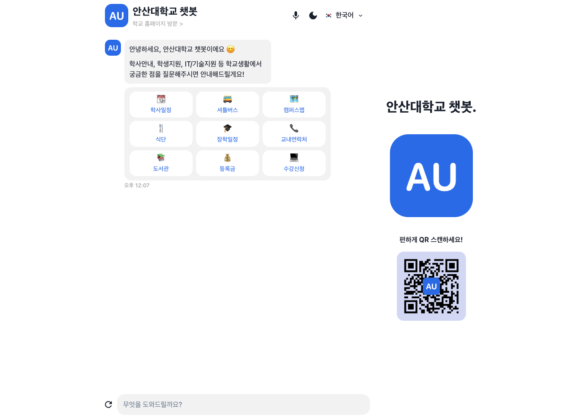
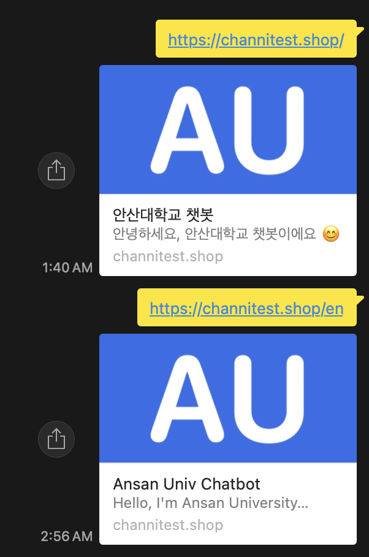
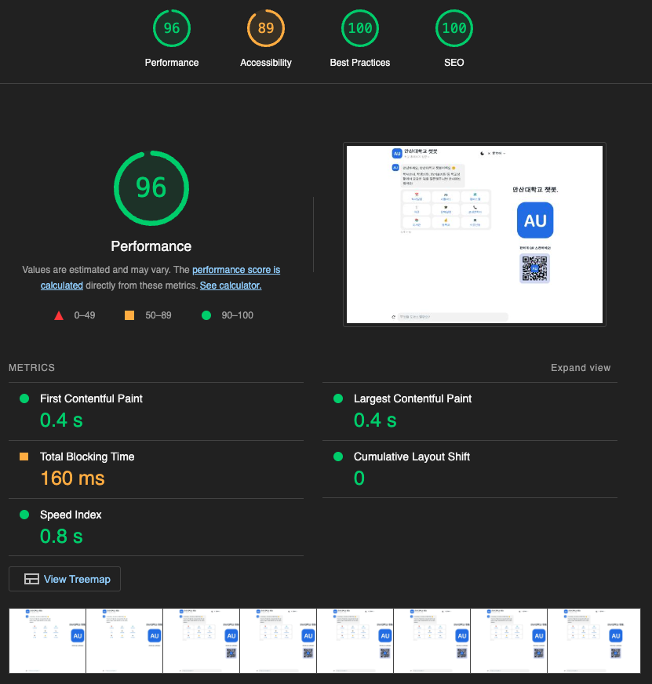

# 안산대 챗봇 프론트엔드 프로젝트 소개

- 안산대 챗봇은 안산대학교 학생들을 위한 챗봇 서비스입니다.
- 다른 대학교 챗봇들을 참고하여 안산대학교 챗봇을 만들어 보았습니다.
- 일반적인 대학교 챗봇과 비슷한 기능들(학사일정, 도서관, 기숙사, 학식 등등)을 제공합니다.

## 제작 기간 📅 && 참여 인원 🧑‍🤝‍🧑

- 2023 10월 23일 ~ 2023 12월 5일 (6주, 학교 기말 기간이라 6주 동안 계속 이것만 개발한건 아닙니다.)
- 프론트엔드 1명 (본인)

## Figma 링크
#### 작동화면과 디자인이 다르게 느껴질수 있는데 Figma디자인과 대부분 컴포넌트는 같으나 막상 구현하니 촌스러운 느낌이 있어 색상 변경과 캐릭터를 사용안하고 로고를 사용하였습니다.
https://www.figma.com/file/UvflORCpX95jk9UvvBSdSj/ansan-univ-chatbot?type=design&node-id=2206%3A22&mode=design&t=bssPUKbjb4sZq64L-1

## 백엔드 프로젝트 링크
https://github.com/pcs9898/ansan-univ-chatbot-backend

## 작동 화면
#### 모바일 UI

#### PC UI

## 주요 기능 ✨

- 학사일정, 셔틀버스, 캠퍼스맵, 식단, 장학일정, 교내연락처, 도서관, 등록금, 수강신청 등의 정보 제공
- 텍스트, 마이크, 카드 버튼으로 쿼리 가능
- 다크모드, 다국어(영어) 지원
- 다국어 OG 지원
  

## 기술 스택 ⚒️

- Next.js
- Chakra-ui
- Recoil
- React-query
- i18next
- React Speech Recognition
- GCP

## 프로젝트 회고 🤔

- 아토믹 패턴을 도입함, ui라이브러리(chakra-ui)를 사용중이라 atoms은 없고 molecules 부터 존재합니다.
- 컨테이너, 프리젠터 패턴과 아토믹패턴을 결합하기 위해 아토믹 패턴에서 템플릿을 프리젠터로, 페이지를 컨테이너로 사용하였습니다.
- 여러가지 최적화를 통해 라이트 하우스 테스트 결과를 최대한 끌어올렸습니다.

- 학사 시스템에 접근 권한이 있다면 개인화된 정보(예: 개인의 시간표) 제공할 수 있었을텐데 현재는 단순 정보만 제공하니 아쉽웠습니다.

[//]: # (# ansan-univ-chatbot-frontend)

[//]: # ()
[//]: # (- [x] feature0/initialSetup)

[//]: # ()
[//]: # (## Commons)

[//]: # ()
[//]: # (- [x] feature1/layouts)

[//]: # (- [x] feature2/molecules)

[//]: # (- [x] feature3/organisms)

[//]: # (- [x] feature4/pages)

[//]: # ()
[//]: # (## ToDOs)

[//]: # ()
[//]: # (- [x] microPhoneInput-google STT)

[//]: # (- [x] darkmode-colorcode, favicon icon change to high resolution)

[//]: # ()
[//]: # (## Optimization)

[//]: # ()
[//]: # (- [ ] usememo, memo, usecallback)
